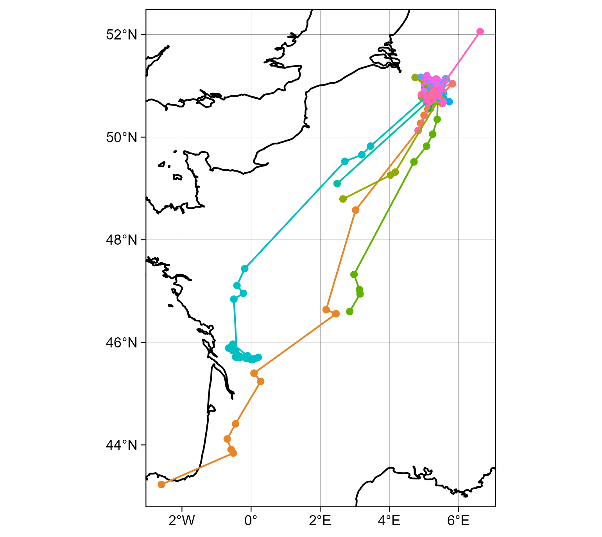

# ICARUS TinyFoxBatt data prep

Here we provide code to download tag data, do some basic data cleaning steps, and then plot the tracks.



# 1. Install the package
Install devtools and then install the package from github.
```install.package(devtools)```

```devtools::install_github("ehurme/SigfoxTagPrep")```

# 2. Import your tag data
Provide the tag IDs and all other capture data you have available for your bats.

# 3. Download the data
```sigfox_download()```: All Sigfox messages should be stored on a database associated with the tag. Here we can include all the fields from the capture sheet to add to our tracks.

# 4. Process data 
```sigfox_to_move2()```: Here we can do some basic processing and cleaning steps to the data
a. remove locations before deployment
b. format the tracks as a move object
c. calculate basic movement statistics (e.g. ground speed)
d. plot the data in a static map

# 5. View data on an interactive map
We can take the ```move2``` tracks and plot them on an interactive ```mapview()``` map. If you click on a point you can then see all sensor and metadata associated with that location.

See the example code for more details.

