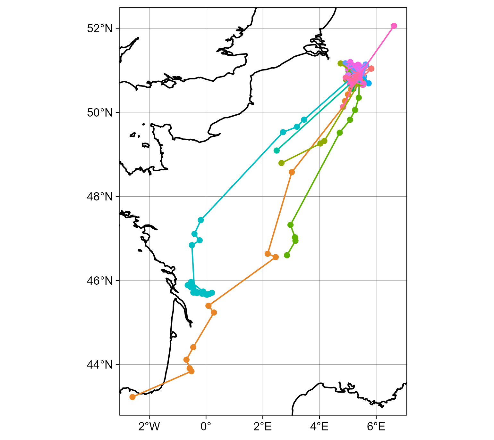

# SigfoxTagPrep

An R package for downloading, processing, and analysing wildlife tracking data
from ICARUS/Sigfox biologger tags — TinyFox, NanoFox, and uWasp.



## Overview

Sigfox-based tracking tags transmit ATLAS location estimates, activity (VeDBA), temperature,
and barometric pressure at programmed intervals. Raw data is downloaded from
[Wildcloud](https://mpi-ab.vercel.app/) and uploaded to
[Movebank](https://www.movebank.org/). This package provides a complete pipeline
from Wildcloud/Movebank downloads through to `move2` objects ready for analysis,
including environmental covariate extraction (ERA5 wind/weather) and migration
bout detection.

## Installation

```r
# install.packages("devtools")
devtools::install_github("ehurme/SigfoxTagPrep")
```

---

## Primary workflow: Wildcloud → Movebank → R

### Step 1 — Prepare reference data and upload to Movebank

Convert a bat capture CSV and Wildcloud downloads into Movebank-formatted files:

```r
library(SigfoxTagPrep)

# 1a. Generate Movebank reference data from your capture sheet
mb_ref <- process_bat_capturesheet_to_movebank(
  capture_csv        = "data/captures_2025.csv",
  out_csv            = "data/movebank/reference-data.csv",
  tz                 = "CET",
  location_name      = "mysite",
  deploy_time_source = "tag_deployment_time",
  tag_count_order    = "deploy_time_then_tag"
)

# 1b. Convert Wildcloud export to Movebank upload format
wildcloud_to_movebank(
  wc_path               = "data/wildcloud/",
  animals_path          = "data/movebank/reference-data.csv",
  output_dir            = "data/movebank/upload/",
  movebank_project_name = "My Bat Study"
)
```

See `explore/export_movebank.R` for site-specific examples from ongoing noctule
studies across Europe.

### Step 2 — Download from Movebank into R

`import_nanofox_movebank()` downloads one or more Movebank studies, computes
movement metrics, converts pressure to altitude, and returns three `move2` objects:

```r
out <- import_nanofox_movebank(
  study_id     = 123456789,
  daily_method = "solar_noon"   # or "daytime_only" / "noon_roost"
)

bats_full  <- out$full      # all sensor rows (locations + VeDBA + pressure + temperature)
bats_loc   <- out$location  # location rows with speed, distance, bearing, displacement
bats_daily <- out$daily     # one representative fix per animal per day
```

### Step 3 — Interactive map

```r
library(mapview)
mapview(bats_loc, zcol = "individual_local_identifier", legend = FALSE)
```

---

## Alternative: direct download via `sigfox_to_move2()`

If you already have a data frame of Sigfox transmissions (e.g. from a prior
`sigfox_download()` call or a manual export), you can convert it directly to a
`move2` object:

> **Note:** `sigfox_download()` scrapes the legacy MPIAB Sigfox web database.
> It is currently functional only for NanoFox tags. All new data should be
> downloaded directly from Wildcloud and uploaded to Movebank.

```r
result <- sigfox_to_move2(
  tracks      = data,
  plot_tracks = TRUE,
  motionless  = FALSE,  # set TRUE to filter likely tag fall-off periods
  make_lines  = TRUE
)

m      <- result[[1]]   # move2 points
ml     <- result[[2]]   # move2 lines (requires make_lines = TRUE)
m_day  <- result[[3]]   # daily summaries
p      <- result[[4]]   # ggplot map
```

---

## Function reference

### Data import

| Function | Description |
|---|---|
| `import_nanofox_movebank()` | Download and process one or more Movebank studies |
| `sigfox_to_move2()` | Convert a data frame of transmissions to a move2 object |

### Movebank and Wildcloud utilities

| Function | Description |
|---|---|
| `process_bat_capturesheet_to_movebank()` | Format a bat capture sheet as Movebank reference data |
| `wildcloud_to_movebank()` | Convert Wildcloud CSV exports to Movebank upload format |
| `wildcloud_nanofox30d_to_movebank()` | As above for 30-day NanoFox deployments |
| `prep_wildcloud_movebank()` | Prepare Wildcloud data for Movebank |
| `fix_basestation_locations()` | Correct base station coordinates in Sigfox data |
| `parse_basestations()` | Parse base station fields from raw Sigfox messages |
| `detect_sigfox_single_base_stations()` | Identify fixes derived from a single base station |

### Sensor processing

| Function | Description |
|---|---|
| `add_min_pressure_to_locations()` | Join minimum 3-hour barometric pressure onto location rows (NanoFox) |
| `add_vedba_temp_to_locations()` | Join summed VeDBA and mean temperature onto location rows |
| `add_altitude_from_pressure()` | Convert barometric pressure to altitude (m) |
| `pressure_to_altitude_m()` | Vectorized ISA hypsometric formula |
| `correct_time_drift()` | Detect and correct clock drift in Wildcloud messages |

### Movement metrics

| Function | Description |
|---|---|
| `calc_displacement()` | Displacement and NSD from deployment origin |
| `diff_dist()` | Inter-fix distance (m) using geodesic calculations |
| `diff_time()` | Time elapsed between consecutive fixes |
| `diff_vedba()` | Change in VeDBA between consecutive fixes |
| `calculate_bearing()` | Bearing between two geographic points |
| `calculate_bearing_for_sequential_points()` | Bearing column for an entire track |

### Environmental covariates

| Function | Description |
|---|---|
| `add_env_to_move2()` | Extract ERA5/ECMWF raster values at each fix location and time |
| `calculate_wind_features()` | Wind support, crosswind, and airspeed from U/V components |
| `add_moonlit_to_move2()` | Moonlight intensity and sun altitude at each fix |
| `extract_avg_night_env()` | Average environmental values over the preceding night |
| `extract_sunset_env()` | Environmental values at sunset for each fix |
| `extract_elevation_segments()` | Elevation profile along flight paths |

### Quality control

| Function | Description |
|---|---|
| `detect_tag_fell_off()` | Detect tag detachment events (TinyFox, NanoFox, uWasp) |
| `tag_fell_off_tinyfox()` | Convenience wrapper for TinyFox detachment detection |
| `tag_fell_off_nanofox()` | Convenience wrapper for NanoFox detachment detection |
| `tag_fell_off_uwasp()` | Convenience wrapper for uWasp detachment detection |
| `evaluate_tag_deployments()` | Audit deployment quality (duration, transmission count, metadata completeness) |

### Daily summaries and thinning

| Function | Description |
|---|---|
| `regularize_to_daily()` | Aggregate to daily summaries (TinyFox/NanoFox/uWasp) |
| `mt_thin_daily_solar_noon()` / `mt_filter_daily_solar_noon()` | Select the fix closest to solar noon per day |
| `mt_add_daily_sensor_metrics()` | Append nightly sensor aggregates to a daily move2 object |
| `mt_add_start()` | Insert a synthetic deployment-start row at the capture location |
| `mt_previous()` / `mt_add_prev_metrics()` | Add lagged speed, distance, and bearing columns |
| `mt_distance2()` | Distance to previous fix (alternate implementation) |

### Migration analysis

| Function | Description |
|---|---|
| `detect_continuous_night_flights()` | Identify sustained nocturnal flight bouts on migratory nights |
| `mt_add_migration_bouts()` | Label migration bouts on a move2 object |
| `migration_ridgeplots()` | Ridge density plots of migration timing |
| `plot_variable_env_ridges()` | Ridge plots of environmental variables along migration |

### Visualisation and export

| Function | Description |
|---|---|
| `scan_track_plot()` | Quick interactive scan of individual tracks |
| `wildcloud_quicklook()` | Quick overview plot of a Wildcloud download |
| `flatten_movedata()` | Flatten a move2 object to a plain data frame |

---

## Tag types supported

| Tag | Manufacturer | Fix interval | Sensors |
|---|---|---|---|
| **TinyFox** (V1 / BB firmware) | MPIAB | ~24 hr | Location, VeDBA, temperature, pressure (P firmware) |
| **NanoFox** | MPIAB | ~3 h | Location, VeDBA (hourly bins), temperature, pressure |
| **uWasp** | Jens Koblitz | ~60 min | Location, temperature |

---

## Dependencies

Core: `move2`, `sf`, `dplyr`, `lubridate`, `ggplot2`, `rvest`, `suncalc`, `janitor`

Optional (for specific functions):
- `terra` — ERA5 raster extraction (`add_env_to_move2`)
- `moonlit` — moonlight covariates (`add_moonlit_to_move2`):
  `devtools::install_github("msmielak/moonlit")`
- `elevatr` — ground elevation lookup
- `geosphere` — geodesic distance calculations
- `lme4` — clock drift modelling (`correct_time_drift`)

---

## Citation

If you use this package please cite:

> Hurme E (2025). *SigfoxTagPrep: Download, Process, and Analyse Sigfox Wildlife
> Tracking Data*. R package version 0.1.0. https://github.com/ehurme/SigfoxTagPrep

## License

MIT © Edward Hurme
